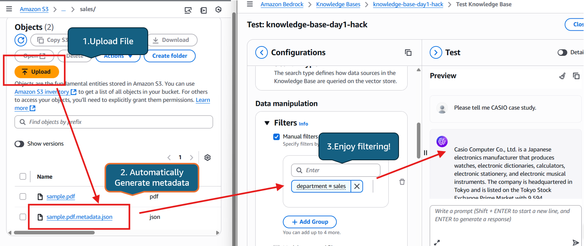

# LAKE: Living Automated Knowledge Engine

## Problem
Poor metadata management severely limits RAG accuracy in knowledge bases. Amazon Bedrock Knowledge Bases requires customers to prepare `metadata.json` files for all documents and column-specific metadata for tabular data. These labor-intensive requirements often lead customers to abandon proper metadata management, resulting in degraded accuracy and forcing reliance on expensive high-performance models to compensate.

## Solution
LAKE provides automatic metadata generation with one-click deployment for S3-based knowledge sources. This agent analyzes files and generates appropriate tags based on user-defined parameters, eliminating manual metadata creation. This AI-powered librarian continuously organizes knowledge sources with minimal human intervention and propose optimized metadata structure based on stored files and user's prompts proactively.

## Impact
LAKE's concept is elegantly simple—automatically generate metadata when files are uploaded—yet delivers transformative results. This innovation emerged from real customer cases, proving its effectiveness: 40% increase in RAG accuracy and 60% reduction in knowledge management costs. By removing technical barriers, LAKE makes high-quality RAG accessible to all customers.

## Quick Start

Deploy LAKE to your AWS account with one click:

