# LAKE Architecture and Implementation Plan

## AWS Architecture

### Phase 1: Core Pipeline

```mermaid
graph TD
    User[👤 User] -->|Upload File| S3[S3 Bucket]
    S3 -->|Object Created Event| EventBridge[EventBridge]
    EventBridge -->|Trigger| Lambda[Lambda Function]
    Lambda -->|Analyze File| Bedrock[Amazon Bedrock]
    Bedrock -->|Generated Metadata| Lambda
    Lambda -->|Store metadata.json| S3
```


### Later Phases: Extended Features

```mermaid
graph TD
    User[👤 User] -->|Upload File| S3[S3 Bucket]
    S3 -->|Object Created Event| EventBridge[EventBridge]
    EventBridge -->|Trigger| Lambda[Lambda Function]
    Lambda -->|Analyze File| Bedrock[Amazon Bedrock]
    Bedrock -->|Generated Metadata| Lambda
    Lambda -->|Store metadata.json| S3
    Lambda -->|Sync for Update| KnowledgeBase[Knowledge Bases]
    
    CloudWatch[⏰ CloudWatch Events] -->|Periodic Trigger| Lambda
    SES[📧 SES] -->|Email Commands| Lambda
    Lambda -->|Send Reports| SES
    
    Lambda -->|Read Config| ConfigFile[config.yaml]
    S3 -.->|Contains| ConfigFile
```


## Implementation Steps

### Phase 1: Core S3 → EventBridge → Lambda Pipeline

#### Step 1.1: S3 Event Configuration
- Configure S3 bucket to send object creation / update events to EventBridge

#### Step 1.2: Lambda Function Development
- Invoke Lambda function for metadata generation
- Identifying appropriate rules for metadata generation from `config.yaml` by referring file name and extension, etc.
   - We will include `config.yaml` to codes for Lambda
- Generate metadata by following rules, file name, and file contents
   - We use Strands Agents (`strands-agents`) to invoke BedrockModel and generate metadata for future agentic implementation
- Store `.metadata.json` as its naming `{file_name}{extension}.metadata.json` to coincise Amazon Bedrock Knowledge Bases rules

Example of `config.yaml`:

```yaml
# Metadata Schema Configuration
metadata_schema:
  # Required fields for all documents
  required_fields:
    - department
    - document_type
    - sensitivity_level    
```

#### Step 1.3: Metadata Generation Logic
- Analyze document content and structure
- Generate appropriate tags based on user-defined parameters
- Create metadata.json files compatible with Bedrock Knowledge Bases
- Handle column-specific metadata for tabular data

### Phase 2: Periodic Processing with CloudWatch

#### Step 2.1: CloudWatch Events Setup
- Configure CloudWatch Events for periodic triggers
- Set up scheduling for batch processing of existing files
- Implement incremental processing to avoid reprocessing unchanged files

#### Step 2.2: Batch Processing Logic
- Scan S3 bucket for files without metadata
- Queue files for processing to handle large volumes
- Add progress tracking and resumption capabilities

### Phase 3: Email Integration with SES

#### Step 3.1: SES Configuration
- Set up SES for sending and receiving emails
- Configure email parsing for user commands
- Implement email templates for reports and notifications

#### Step 3.2: Email Command Processing
- Parse incoming emails for metadata update requests
- Implement command validation and authentication
- Add support for metadata statistics requests

#### Step 3.3: Reporting System
- Generate metadata statistics and summaries
- Send periodic reports via email
- Implement user-friendly formatting for technical data

### Phase 4: Configuration and Customization

#### Step 4.1: Configuration Management
- Create config.yaml structure for user-defined parameters
- Implement configuration validation and defaults
- Add support for department/role-based filtering rules

#### Step 4.2: User Parameter Integration
- Allow customization of metadata generation rules
- Support different tagging strategies per file type
- Enable user-defined classification categories

## Technical Considerations

### Security
- IAM roles and policies for least privilege access
- Encryption for data in transit and at rest
- Secure handling of email content and attachments

### Scalability
- Lambda concurrency limits and error handling
- S3 event processing at scale
- Bedrock API rate limiting and cost optimization

### Monitoring
- CloudWatch metrics for processing success/failure rates
- Cost tracking for Bedrock API usage
- Performance monitoring for large file processing

### Error Handling
- Retry logic for transient failures
- Dead letter queues for failed processing
- User notification for processing errors

## Deployment Strategy

1. **Infrastructure as Code**: Use CDK TypeScript for reproducible deployments
2. **Gradual Rollout**: Start with small file sets before full deployment
3. **Monitoring Setup**: Implement comprehensive logging and alerting before production use
