# LAKE Email Integration Design

## Overview

This document outlines the email integration functionality for LAKE (Living Automated Knowledge Engine) to support:
1. Document uploads via email attachments
2. Metadata statistics requests via email commands
3. Automated email responses and reports

## Architecture

### Email Processing Pipeline

```mermaid
graph TD
    User[👤 User] -->|Send Email with Attachment| SES[Amazon SES]
    SES -->|Store Email| S3Email[S3 Email Bucket]
    S3Email -->|Object Created Event| EventBridge[EventBridge]
    EventBridge -->|Trigger| EmailLambda[Email Processor Lambda]
    EmailLambda -->|Parse Email| EmailLambda
    EmailLambda -->|Extract Attachments| S3Data[S3 Data Bucket]
    S3Data -->|Object Created Event| EventBridge
    EventBridge -->|Trigger| MetadataLambda[Metadata Generator Lambda]
    EmailLambda -->|Send Response| SES
    SES -->|Email Response| User
```


### Email Command Processing

```mermaid
graph TD
    User[👤 User] -->|Send Command Email| SES[Amazon SES]
    SES -->|Store Email| S3Email[S3 Email Bucket]
    S3Email -->|Object Created Event| EventBridge[EventBridge]
    EventBridge -->|Trigger| EmailLambda[Email Processor Lambda]
    EmailLambda -->|Parse Command| EmailLambda
    EmailLambda -->|Query Metadata| S3Data[S3 Data Bucket]
    EmailLambda -->|Generate Report| EmailLambda
    EmailLambda -->|Send Report| SES
    SES -->|Email Report| User
```


## Components

### 1. Amazon SES Configuration

#### Inbound Email Rules
- **Upload Email**: `upload@lake.{domain}.com`
  - Accepts emails with document attachments
  - Stores raw email in S3 email bucket
  
- **Reports Email**: `reports@lake.{domain}.com`
  - Accepts command emails for statistics and reports
  - Stores raw email in S3 email bucket

#### Email Templates
- **Upload Confirmation**: Confirms successful document processing
- **Error Notification**: Reports processing failures
- **Statistics Report**: Formatted metadata statistics
- **Command Help**: Available email commands

### 2. Email Processor Lambda Function

#### Core Responsibilities
- Parse incoming emails from S3
- Extract and validate attachments
- Process email commands
- Generate appropriate responses
- Handle authentication and authorization

#### Email Parsing Logic
```python
class EmailProcessor:
    def parse_email(self, s3_object: str) -> EmailData:
        """Parse raw email from S3 and extract components."""
        
    def extract_attachments(self, email_data: EmailData) -> list[Attachment]:
        """Extract document attachments from email."""
        
    def process_command(self, email_data: EmailData) -> CommandResult:
        """Process email commands like 'get stats'."""
        
    def send_response(self, recipient: str, template: str, data: dict):
        """Send formatted email response."""
```

#### Supported Email Commands
- `get stats` - Returns metadata statistics
- `get stats [department]` - Department-specific statistics  
- `help` - Lists available commands
- `status [filename]` - Check processing status of specific file

### 3. S3 Email Bucket

#### Structure
```
email-bucket/
├── inbound/
│   ├── upload/          # Emails to upload@
│   └── reports/         # Emails to reports@
├── processed/           # Successfully processed emails
└── failed/              # Failed email processing
```

#### Lifecycle Policies
- Move processed emails to IA after 30 days
- Delete emails after 90 days
- Retain failed emails for 7 days for debugging

### 4. Enhanced CDK Stack

#### New Constructs
- `LAKEEmailProcessor` - Email processing Lambda and SES configuration
- `LAKEEmailBucket` - S3 bucket for email storage
- `LAKEEmailRules` - SES receipt rules and routing

## Implementation Steps

### Step 1: SES Domain Setup
1. **Verify Domain**: Configure DNS records for email domain
2. **Create Receipt Rules**: Route emails to S3 bucket
3. **Configure DKIM**: Enable email authentication

### Step 2: Email Processor Lambda
1. **Create Lambda Function**: Email parsing and processing logic
2. **Add Dependencies**: Email parsing libraries (email, boto3)
3. **Configure Triggers**: EventBridge rules for S3 email events
4. **Add Permissions**: SES send permissions, S3 read/write

### Step 3: Email Templates
1. **Upload Confirmation Template**:
   ```
   Subject: Document Upload Successful - {{filename}}
   
   Your document "{{filename}}" has been successfully uploaded and processed.
   
   Generated Metadata:
   - Department: {{department}}
   - Document Type: {{document_type}}
   - Sensitivity: {{sensitivity_level}}
   
   The document is now searchable in your Knowledge Base.
   ```

2. **Statistics Report Template**:
   ```
   Subject: LAKE Metadata Statistics Report
   
   Document Statistics:
   - Total Documents: {{total_documents}}
   - Departments: {{department_count}}
   - Document Types: {{document_types}}
   - Last 7 Days: {{recent_uploads}}
   
   Top Departments:
   {{#departments}}
   - {{name}}: {{count}} documents
   {{/departments}}
   ```

### Step 4: Security and Authentication
1. **Email Validation**: 
   - SPF/DKIM/DMARC verification
   - Sender domain allowlist in config.yaml
   - Individual email address authorization
2. **Malware Protection**:
   - Amazon GuardDuty Malware Protection for S3
   - File type restrictions (PDF, DOCX, TXT, XLSX only)
   - File size limits (25MB max per attachment)
3. **Rate Limiting**: 
   - Max 10 emails per sender per hour
   - Max 5 attachments per email
   - DynamoDB tracking for rate limits
4. **Content Validation**:
   - Quarantine bucket for suspicious files
   - Manual review workflow for flagged content
   - Automated virus scanning before processing

## Configuration

### Email Settings in config.yaml
```yaml
email:
  domain: "lake.techcorp.com"
  upload_address: "upload"
  reports_address: "reports"
  
  # Security - Domain Allowlist
  allowed_domains:
    - "techcorp.com"
    - "contractor.techcorp.com"
    - "partner.example.com"
  
  # Limits
  max_attachment_size: "25MB"
  max_attachments_per_email: 5
  
  # Templates
  templates:
    upload_success: "upload-confirmation"
    upload_error: "upload-error"
    stats_report: "statistics-report"
    command_help: "help-commands"
```

## Error Handling

### Email Processing Errors
- **Invalid Attachment**: Notify sender of unsupported file types
- **Size Limits**: Inform about attachment size restrictions
- **Processing Failure**: Send error details and retry instructions
- **Authentication Failure**: Reject emails from unauthorized senders

### Monitoring and Alerts
- **CloudWatch Metrics**: Email processing success/failure rates
- **Dead Letter Queue**: Failed email processing for manual review
- **SNS Notifications**: Alert administrators of system issues

## Testing Strategy

### Unit Tests
- Email parsing logic
- Attachment extraction
- Command processing
- Template rendering

### Integration Tests
- End-to-end email flow
- SES integration
- S3 event processing
- Lambda function execution

### User Acceptance Tests
- Upload documents via email
- Request statistics via email
- Verify email responses
- Test error scenarios

## Deployment Considerations

### Phased Rollout
1. **Phase 1**: Basic email upload functionality
2. **Phase 2**: Command processing and statistics
3. **Phase 3**: Advanced features and templates

### Domain Configuration
- DNS setup for email domain
- SPF/DKIM records for deliverability
- MX record configuration

### Monitoring Setup
- Email delivery metrics
- Processing latency tracking
- Error rate monitoring
- Cost tracking for SES usage
